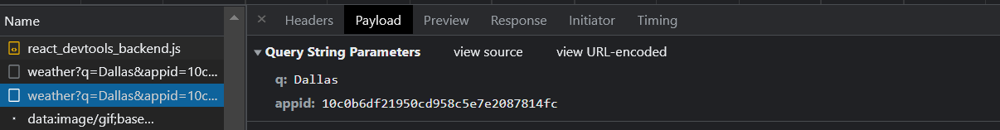

# Deliverable 1:

## The Problem:

- Ignored type errors and not using best practices
- Component not catching and displaying loading state

## The Fix:

1. Changed formData implementation to use state for gathering input
2. Returned a loading label while component retrieves weather information
3. Added typings for [weather result](/types.ts)

<br></br>

# Deliverable 2:

🚧 For the purpose of the assessment, I duplicated the index page for [Deliverable 2](/pages/deliverable2.tsx)

## Additional Changes:

- API key placed in .env file to avoid hardcoding
- Changed folder structure to follow [recommended structure for tests](__tests__/pages/deliverable2.test.tsx)

- Error handling

## Known Compromises:

1. The API key that is supposed to be private is currently exposed to the browser.
   <br><br/>
   
   <br><br/>

   - To prevent this, a Next.js API route should be used to make the request to openweather instead of through the client. [This is the created route](/pages/api/weather.ts)
   - An example request to this route would look like this:

     ```tsx
     fetch(`/api/weather?city=${props.city}`).then(async (r) =>
       setWeatherResult(await r.json())
     );
     ```
